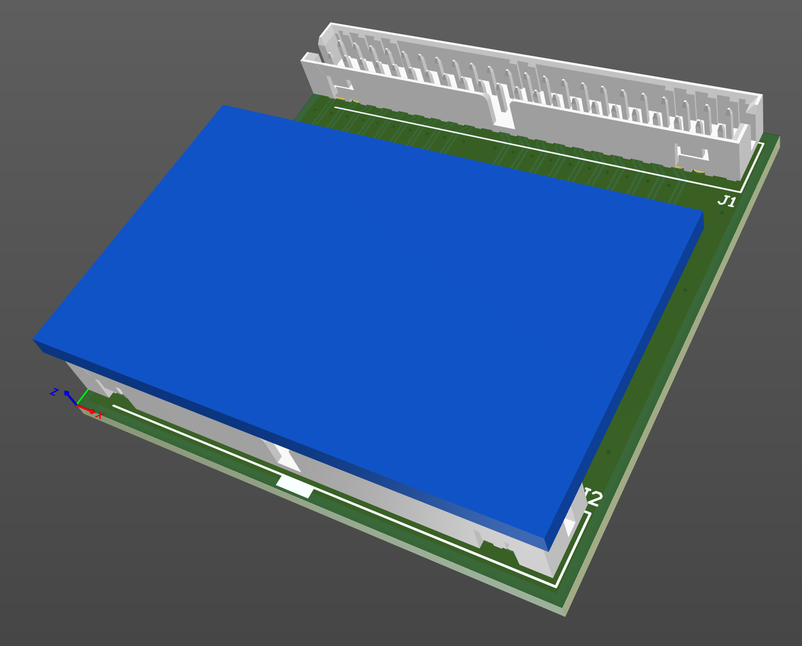

# IDE 44 pin male to 44 pin male adapter

July 2023

A simple adapter to convert a 44pin IDE device for an IDE 44pin host with cable - replicating the orientation of a standard 2.5" drive.
Nominally this is for plugging 'DOM' devices in to Acorn A4.

This has not yet been built.

## Licence

No warranty is provided, and this work is used at your own risk.  

Licenced as CC BY-SA 3.0

Copyright 2023 Ian Jeffray

